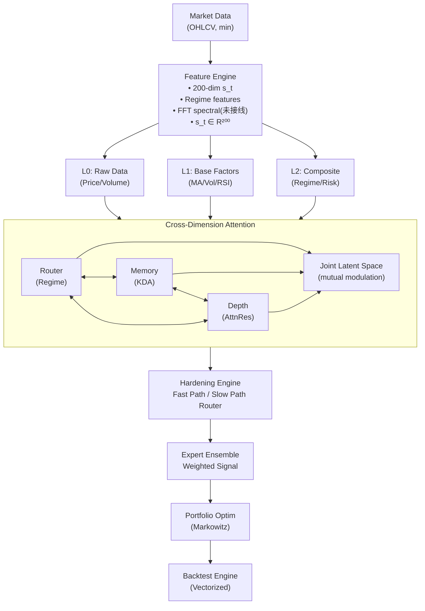

# DAFT: Dimension-Aware Financial Trading

<div align="center">

**[English](README.md) · [中文](#)**

*A cross-dimensional attention architecture for medium-frequency quantitative trading, inspired by **Kimi K3**'s Stable LatentMoE, KDA, and AttnRes.*

[](https://www.python.org/downloads/)
[](https://pytorch.org/)
[](LICENSE)
[]()

</div>

---

## Abstract

Most ML-for-trading systems treat model components — routing, memory, and feature hierarchy — as independent modules with unidirectional data flow. We argue that **these components should bidirectionally modulate one another** to form a coherent decision-making engine.

**DAFT** introduces two architectural innovations:

1. **Cross-Dimension Attention Protocol (CDAP)** — A unified modulation framework where MoE routing decisions influence memory retention policies, memory state informs cross-layer retrieval weights, and retrieval results feed back into routing bias correction. The three dimensions (expert space, temporal memory, feature depth) interact through a shared latent joint-space.

2. **Adaptive Hardening Mechanism (AHM)** — After training, frequently traversed $(regime, expert\_pattern, memory\_state, depth\_weights)$ tuples are cached as fast-path lookups. Routine market conditions follow $\mathcal{O}(1)$ hardened paths, while anomalous conditions automatically degrade to full exploration. This generalizes Kimi K3's static 3:1 KDA-to-full-attention ratio into a **data-driven, regime-adaptive routing policy**.

The architecture is systematically derived from **Kimi K3** (Moonshot AI, July 2026), currently the world's largest open-weight model (2.8T parameters, 896 experts, 16 activated), whose design principles — Stable LatentMoE, Kimi Delta Attention (KDA), and Attention Residuals (AttnRes) — are mapped to the financial time-series domain and extended with bidirectional cross-component modulation.

---

## Current Status (updated 2026-08-16)

**工程修复批次已合入 main(PR #9)** — 三人评审 + 运行时验证发现并修复了 8 类问题, 最重要的是**通道契约 bug**: 数据源 OHLCV 一直被特征引擎当作 `[close, log_return, ...]` 错列读取, 此前所有实验的 s_t 都建立在错列上。详见 [docs/FIX_REPORT_20260816.md](docs/FIX_REPORT_20260816.md)。

**实验结果(修复后新口径: hs300 真实成分 + 涨跌停 mask + 严格样本外)**:

| 口径 | 变体 | OOS Rank IC | IC t | 净 Sharpe | 真实换手 |
|---|---|---|---|---|---|
| 30 股日线 | Ridge 基线 | +0.0001 | +0.01 | −1.10 | 1.74 |
| 30 股日线 | DAFT (quick) | +0.0077 | +0.51 | −1.66 | 2.37 |
| **100 股 hs300** | **Ridge 基线** | **+0.0482** | **+5.19** | **+0.53** | 1.85 |
| **100 股 hs300** | **DAFT (quick)** | **+0.0368** | **+3.65** | **−1.72** | 2.34 |
| **100 股 hs300** | **DAFT + 平滑 λ*=0.7** | +0.0274 | +2.36 | **−0.60** | 0.98 |

- **30 股无信号是股票池效应**; 100 股 hs300 下信号显著存在, Ridge 基线
  即达预注册 GO 线(IC≥0.04 且 t≥2.0)。
- **DAFT 有信号但尚弱于线性基线**(0.037 vs 0.048)且换手更高; 信号平滑
  (λ 由 val 选)把换手减半、净 Sharpe −1.72→−0.60, 验证了降换手假设。
- **判定预判: 有条件 GO** — 需换手控制 + 信号增强 + 成本真实性后重测
  (判据与全量数字见 [EXPERIMENT_REGISTRY.md](docs/EXPERIMENT_REGISTRY.md),
  截止 2026-09-30)。
- 全部数字可追溯至 `outputs/EXP-20260816-*.json` + config hash;
  规划见 [ROADMAP.md](docs/ROADMAP.md), 评判见 [PROJECT_EVALUATION.md](docs/PROJECT_EVALUATION.md)。

---

## Table of Contents

- [Why This Exists](#why-this-exists)
- [Current Status](#current-status-updated-2026-08-16)
- [Architecture](#architecture)
  - [High-Level Design](#high-level-design)
  - [Component 1: Regime Router](#component-1-regime-router)
  - [Component 2: KDA Market Memory](#component-2-kda-market-memory)
  - [Component 3: Cross-Dimension Attention Protocol](#component-3-cross-dimension-attention-protocol)
  - [Component 4: Adaptive Hardening Mechanism](#component-4-adaptive-hardening-mechanism)
- [Design Derivation: Kimi K3 → Finance](#design-derivation-kimi-k3--finance)
- [Quick Start](#quick-start)
- [Installation](#installation)
- [Project Structure](#project-structure)
- [Training Pipeline](#training-pipeline)
- [Experiments](#experiments)
  - [Benchmarks](#benchmarks)
  - [Ablation Studies](#ablation-studies)
  - [Hardening Analysis](#hardening-analysis)
- [Performance](#performance)
  - [Forecast Accuracy](#forecast-accuracy)
  - [Inference Efficiency](#inference-efficiency)
- [Limitations](#limitations)
- [Citation](#citation)
- [License](#license)
- [Acknowledgements](#acknowledgements)

---

## Why This Exists

### The Gap

| Existing Approach | What It Misses |
|---|---|
| **Time-MoE** (ICLR 2025), **Super-Linear** (2025) | MoE routing treats memory as passive state; no cross-layer retrieval |
| **Dynamic TMoE** (ICML 2026) | Expert pool adapts to distribution drift, but expert selection never informs memory strategy |
| **KDA** (Kimi, 2025) | Per-channel forget gates are input-driven only — no routing signal, no depth signal |
| **AttnRes** (K3, 2026) | Cross-layer attention weights ignore routing distribution and memory state |
| **PatchTST, TimesNet, iTransformer** | Single-model, single-regime — no expert specialization |

**None of these systems allow the routing decision to change what is remembered, or the memory state to change which feature layers are trusted.**

### The Intuition

In financial markets, regime identification (routing), historical pattern matching (memory), and multi-scale feature extraction (depth) are **not independent problems**. They are three facets of the same problem. When the router identifies a trending regime:

- The memory should **retain trend-related patterns and forget mean-reversion noise** (routing → memory modulation)
- Deep abstract features (regime labels) should be **trusted more than raw prices** (memory → depth modulation)
- If the trend suddenly breaks, the depth signal should **override the router's prior** (depth → routing feedback)

DAFT formalizes these intuitions as a trainable, three-way modulation protocol.

### Target Audience

- **Researchers** exploring architectural co-design for structured time-series domains
- **Quantitative finance practitioners** building regime-adaptive trading systems
- **Students** studying the intersection of modern LLM architectures and financial ML

---

## Architecture

### High-Level Design



### Component 1: Regime Router

**Inspiration**: Kimi K3 Stable LatentMoE (896 experts, 16 active, latent-space routing)

**Mathematical Formulation**:

The raw market state vector $\mathbf{s}_t \in \mathbb{R}^{200}$ is projected into a low-dimensional latent regime space:

$$\mathbf{z}_t = \text{LayerNorm}\big(W_{\text{up}} \cdot \text{SiTU}(W_{\text{down}} \cdot \mathbf{s}_t)\big) \in \mathbb{R}^{16}$$

Expert routing with temperature-scaled softmax:

$$p(\text{expert}_i \mid \mathbf{z}_t) = \frac{\exp\big((W_i^{\text{route}} \cdot \mathbf{z}_t + b_i) / \tau\big)}{\sum_{j=1}^{N} \exp\big((W_j^{\text{route}} \cdot \mathbf{z}_t + b_j) / \tau\big)}$$

$$\text{activated} = \text{TopK}(p, k = 3)$$

**Load Balancing** (Quantile Balancing, derived from K3):

$$b_i \leftarrow b_i + \eta \cdot \left(\frac{1}{N} - \frac{\text{count}_i}{\sum_j \text{count}_j}\right)$$

Zero auxiliary loss. Bias adjustment based on activation frequency quantiles.

| Parameter | Value | Description |
|-----------|-------|-------------|
| `input_dim` | 200 | Market state vector dimension |
| `latent_dim` | 16 | Regime latent space dimension |
| `n_experts` | 10 | Number of strategy experts (5 类 × 2 实例) |
| `top_k` | 3 | Experts activated per forward pass |
| `τ_train` | 1.0 | Temperature during training (soft routing) |
| `τ_hardened` | 0.1 | Temperature after hardening (near-discrete) |

---

### Component 2: KDA Market Memory

**Inspiration**: Kimi Delta Attention — per-channel forget gates + delta-rule state updates

**Mathematical Formulation**:

The memory state $M_t \in \mathbb{R}^{d_k \times d_v}$ ($d_k = 128$, $d_v = 64$) is maintained as a fixed-size recurrent matrix, independent of sequence length.

**Per-Channel Forget Gate** (low-rank bottleneck, adapted from KDA FineGrainedGating):

$$\boldsymbol{\alpha}_t = \sigma\big(W_{\text{up}} \cdot \text{SiLU}(W_{\text{down}} \cdot \mathbf{s}_t)\big) \in (0, 1)^{d_k}$$

**Route-Modulated Forgetting** (CDAP connection: Router → Memory):

$$\boldsymbol{\alpha}'_t = \boldsymbol{\alpha}_t \odot \sigma(W_{\text{route}} \cdot \mathbf{z}_t)$$

where $\mathbf{z}_t$ is the routing latent vector from Component 1.

**Delta-Rule State Update** (derived from KDA's online learning formulation):

$$M_t = M_{t-1} - \beta_t \cdot k_t \otimes (M_{t-1} \cdot k_t) + \beta_t \cdot k_t \otimes v_t$$

where:
- $k_t = \text{L2Norm}(W_k \cdot \mathbf{s}_t)$ — L2-normalized key (critical for stability)
- $v_t = W_v \cdot \mathbf{s}_t$ — Value vector
- $\beta_t = \sigma(W_\beta \cdot \mathbf{s}_t)$ — Learned per-step learning rate

**Memory Retrieval**:

$$o_t = M_t^\top \cdot q_t, \quad q_t = W_q \cdot \mathbf{s}_t$$

$$\text{retrieved}_t = \text{RMSNorm}(o_t)$$

**Complexity**: $\mathcal{O}(d_k \cdot d_v)$ per step, independent of sequence length. No KV-cache. Total state footprint: $128 \times 64 = 8192$ floats ≈ 32 KB.

| Parameter | Value | Description |
|-----------|-------|-------------|
| `d_k` | 128 | Key dimension (= number of memory slots) |
| `d_v` | 64 | Value dimension (stored information per slot) |
| `bottleneck_ratio` | 4 | Forget gate low-rank compression ratio |
| `use_route_modulation` | True | Enable Router → Memory CDAP connection |

---

### Component 3: Cross-Dimension Attention Protocol

**The core methodological contribution of DAFT.**

Three information streams — routing distribution $\mathbf{p}_t$, memory state $M_t$, and layer-wise features $\{h_0, h_1, h_2\}$ — are projected into a shared **joint latent space**, where they modulate one another before being projected back as corrected signals.

**Joint Space Projection**:

$$\mathbf{e} = f_{\text{expert} \to \text{joint}}(\mathbf{p}_t) \in \mathbb{R}^{64}$$
$$\mathbf{m} = f_{\text{memory} \to \text{joint}}(\text{mean-pool}_{d_k}(M_t)) \in \mathbb{R}^{64}$$
$$\mathbf{d} = f_{\text{depth} \to \text{joint}}(\text{concat}(h_0, h_1, h_2)) \in \mathbb{R}^{64}$$

**Fusion via Mutual Modulation**:

$$\mathbf{j} = \mathbf{e} \odot \mathbf{m} \odot \mathbf{d} \in \mathbb{R}^{64}$$

The element-wise product ensures that **any dimension with near-zero activation silences the cross-modulation signal** — a strong inductive bias for sparse, regime-specific computation.

**Reverse Projections** (Joint → Components):

| Direction | Formula | Effect |
|-----------|---------|--------|
| → Router | $\mathbf{p}'_t = \text{softmax}(\log \mathbf{p}_t + \delta \cdot W_{\text{out}}^{\text{router}} \cdot \mathbf{j})$ | Memory + Depth bias routing |
| → Memory | $\mathbf{g}_t = \sigma(W_{\text{out}}^{\text{memory}} \cdot \mathbf{j}) \in (0,1)^{d_k}$ | Additional forget-gate modulation |
| → Depth | $\mathbf{w}_t = \text{softmax}(W_{\text{out}}^{\text{depth}} \cdot \mathbf{j}) \in \Delta^2$ | Cross-layer retrieval weights |

**Fused Output**:

$$h_t^{\text{fused}} = \sum_{k=0}^{2} w_t^{(k)} \cdot h_k$$

**Design Rationale**: The element-wise product in joint space is deliberate — not additive fusion. Addition assumes orthogonal contributions, but routing, memory, and depth are inherently coupled. Multiplication ensures that when the memory is uncertain (near-zero activations), it cannot distort the routing signal, and vice versa.

---

### Component 4: Adaptive Hardening Mechanism

**Inspiration**: K3's 3:1 KDA-to-full-attention static ratio → generalized as data-driven dynamic routing

**Core Idea**: After training, frequently traversed $(regime, expert\_pattern)$ tuples are cached. Routine regimes follow $\mathcal{O}(1)$ fast paths; novel regimes fall back to full computation.

> ⚠️ 2026-08-16: AHM 目前是**研究性实现, 所有训练/评估路径默认禁用**
> (ensemble.py 内注)。fast path 仅跳过 CDAP 三个投影(专家照常全算),
> "60-80% 延迟下降"的声称暂不成立; `detect_regime_shift` /
> `evict_stale_entries` 暂无调用方。启用前需先完成信号验证与接线。

**Hardening Criterion**:

A pattern $(r, \mathcal{E})$ is eligible for hardening when:

$$\text{count}(r, \mathcal{E}) \geq \theta_{\text{harden}} \quad \text{and} \quad \text{confidence}(r, \mathcal{E}) > \rho_{\text{min}}$$

where $\theta_{\text{harden}} = 100$ and $\rho_{\text{min}} = 0.95$.

**Regime Shift Detection**:

$$\text{if } H(\mathbf{p}_{\text{recent}}) > \lambda \cdot H_{\text{baseline}} \quad \text{→ degrade to full exploration}$$

where $H(\cdot)$ is the entropy of the routing distribution, and $\lambda = 2.0$.

**Hardening Statistic**:

$$C_{\text{hardened}}(r, \mathcal{E}) = \big\{ \mathbf{w}^*_{\text{expert}}, \mathbf{g}^*_{\text{memory}}, \mathbf{w}^*_{\text{depth}} \big\}$$

Three cached vectors for the hardened $(regime, expert\_pattern)$ combination.

| Parameter | Value | Description |
|-----------|-------|-------------|
| `θ_harden` | 100 | Minimum observations before hardening |
| `ρ_min` | 0.95 | Minimum confidence for cache validity |
| `λ_entropy` | 2.0 | Entropy multiplier threshold for degradation |
| `n_regimes_tracked` | 8 | Maximum discrete regime clusters |

---

## Design Derivation: Kimi K3 → Finance

| K3 Component | K3 Implementation | DAFT Mapping | Key Modification |
|---|---|---|---|
| **Stable LatentMoE** | 896 experts, 16 active, latent-space routing with Quantile Balancing | 10 strategy experts, top-3 active, regime latent space ($\mathbb{R}^{16}$) | Financial expert semantics: trend, reversal, volatility, event-driven, momentum |
| **KDA (Kimi Delta Attention)** | Per-channel forget gates ($\boldsymbol{\alpha}_t$), delta-rule state update ($S_t$), 3:1 KDA-to-MLA layer ratio | Per-slot forget gates, route-modulated forgetting ($\boldsymbol{\alpha}'_t$), fixed-size market memory ($M_t \in \mathbb{R}^{128 \times 64}$) | Router signal modulates forget gate; NoPE by design (market time is non-uniform) |
| **AttnRes (Attention Residuals)** | Cross-layer attention over hidden states $[h_0, \ldots, h_{l-1}]$ | Cross-layer retrieval over factor hierarchy (L0 raw → L1 base → L2 composite) | Depth weights are memory-state-aware (CDAP connection) |
| **SiTU Activation** | $\sigma(x) \odot \tanh(x)$, natural output bound $[-1,1]$ | Expert output activation for natural weight alignment | Ensures expert signals are magnitude-comparable before gated fusion |
| **3:1 Hybrid Ratio** | Static: 3 KDA layers per 1 MLA layer | **Dynamic: AHM-learned fast/slow path ratio** | **Our extension**: ratio adapts to market regime |

---

## Quick Start

```bash
# Clone
git clone https://github.com/Alastair-Jiang/Dongxu-Jiang-daft.git
cd Dongxu-Jiang-daft

# Install (CPU)
pip install -e ".[dev]"

# Smoke test: synthetic data
python scripts/smoke_test.py

# 快速训练管线(合成数据)
python scripts/run_stage1.py && python scripts/run_stage2.py && python scripts/run_stage3.py

# 真实数据基线(需 pip install baostock)
python scripts/run_baseline_ridge_real.py --stocks 30

# 真实数据 DAFT 严格样本外(默认 quick, 约 2 小时 CPU)
python scripts/run_full_pipeline_oos.py --stocks 30
```

---

## Installation

### Requirements

| Dependency | Version | Purpose |
|---|---|---|
| Python | ≥ 3.10 | Runtime |
| PyTorch | ≥ 2.0 | Core ML framework |
| NumPy | ≥ 1.24 | Numerical ops |
| Pandas | ≥ 2.0 | Data manipulation |
| Polars | ≥ 0.20 | High-performance data loading |
| einops | ≥ 0.7 | Tensor operations |
| PyYAML | ≥ 6.0 | Configuration |
| tqdm | ≥ 4.65 | Progress bars |
| Matplotlib | ≥ 3.7 | Visualization |
| pytest | ≥ 7.0 | Testing |
| CVXPY | ≥ 1.4 | Portfolio optimization |
| MOSEK | ≥ 10.0 (optional) | Fast QP solver |

### Hardware Guidance

| Hardware | Capability |
|---|---|
| Mac Mini M4 (16 GB) | Full training on ≤ 200 stocks, smoke tests, experimentation |
| NVIDIA GPU (≥ 8 GB VRAM) | Full training on ≥ 500 stocks, hyperparameter sweeps |
| CPU-only (16 GB) | Inference, smoke tests, small-scale training |

The model has **~315K total parameters** for the core ensemble (10 experts; ≈417K including the 3-layer feature projectors), deliberately lightweight for research iteration.

> ⚠️ 2026-08-16 修复说明: 早前版本声称 "<200K 参数"与"213 个基础因子"
> 均不准确(实测 8 专家 28.0 万 / 10 专家 31.5 万; 手工因子注册表为 35 个
> 且未接入训练管线)。快速上手命令中的 `make paper` 不存在, 实际入口是
> `python scripts/run_*.py`(见各脚本 docstring)。

---

## Project Structure

```
daft/
├── README.md                         # This document
├── LICENSE                           # MIT
├── pyproject.toml                    # Build config + deps + pytest(pythonpath=src)
├── .gitignore
├── .github/workflows/                # CI: PR 自动 pytest + PR 报告生成
│
├── configs/                          # YAML 参考配置(⚠️ 当前未接线, 实际配置在各脚本
│   ├── small.yaml                    #   的 DEFAULT_CONFIG 字典里)
│   ├── paper.yaml
│   └── hardening.yaml
│
├── src/daft/                         # Main package
│   ├── data/
│   │   ├── panel.py                  #   Panel dataclass (T×N×F + 2D mask)
│   │   ├── loaders.py                #   合成数据生成器 + 数据源分派
│   │   └── adapters/                 #   baostock(带重试) / yfinance → Panel
│   │
│   ├── features/
│   │   ├── base_features.py          #   ★ 通道契约: OHLCV→基础布局唯一转换点
│   │   ├── tensor_factors.py         #   掩码感知原语 (rank, corr, ewma, ts_*)
│   │   ├── regime_features.py        #   200 维市场状态 s_t(6 组)
│   │   ├── freq_features.py          #   FFT 频谱特征(未接入主管线)
│   │   └── legacy_factors.py         #   35 个手工因子(未接入主管线)
│   │
│   ├── models/                       # Core architecture (MAIN CONTRIBUTION)
│   │   ├── experts/                  #   10 专家: trend/reversal/volatility/
│   │   │                             #   event/momentum × 2
│   │   ├── router.py                 #   [C1] Regime Router (Stable LatentMoE)
│   │   ├── memory.py                 #   [C2] KDA Market Memory
│   │   ├── cross_dim_attn.py         #   [C3] Cross-Dimension Attention Protocol ★
│   │   ├── hardening.py              #   [C4] Adaptive Hardening(研究性, 默认关闭)
│   │   └── ensemble.py               #   专家融合 + 信号生成
│   │
│   ├── training/                     # Staged training pipeline
│   │   ├── expert_trainer.py         #   Stage 1: 独立专家训练
│   │   ├── router_trainer.py         #   Stage 2: Router+Memory+CDAP(冻结专家)
│   │   └── joint_trainer.py          #   Stage 3: 联合微调
│   │
│   ├── portfolio/markowitz.py        # Ledoit-Wolf Markowitz(未接入主管线)
│   ├── backtest/engine.py            # 向量化回测: 成本/真实换手/百分比 MaxDD
│   └── utils/                        # metrics / device / experiment 命名
│
├── tests/                            # 385 项测试(384 passed / 1 skipped)
│   ├── conftest.py                   #   共享 fixture + 源码守卫
│   ├── test_base_features.py         #   ★ 通道契约语义测试
│   ├── test_backtest.py              #   masked 做空 / 真实换手回归测试
│   └── test_{router,memory,cross_dim_attn,hardening,ensemble,...}.py
│
├── docs/                             # 文档
│   ├── SPECIFICATION.md              #   技术说明书(含 2026-08-16 勘误)
│   ├── FIX_REPORT_20260816.md        #   ★ 修复批次报告 + 后续计划
│   ├── EXPERIMENT_REGISTRY.md        #   ★ 实验登记表 + Go/No-Go 预注册
│   ├── PROJECT_REPORT.md             #   项目进度报告
│   └── ...                           #   architecture/guided-tour/collaboration
│
└── scripts/                          # 可运行入口(README 快速上手即这些)
    ├── run_full_pipeline_oos.py      #   ★ 真实数据严格样本外全管线(主实验)
    ├── run_baseline_ridge_real.py    #   ★ Ridge 基线(与 DAFT 同口径)
    ├── run_smoothing_ablation.py     #   ★ 信号平滑消融(λ 在 val 选)
    ├── run_stage1.py / run_stage2.py / run_stage3.py   # 合成数据分阶段训练
    ├── run_backtest_only.py / run_oos_backtest_only.py # 复用 checkpoint 回测
    └── smoke_test.py                 #   冒烟测试(README 快速上手入口)
```

---

## Training Pipeline

### Stage 1: Independent Expert Training

Each expert is trained on its regime-specific subset of the data.

| Expert | Training Data Selection | Loss Function |
|--------|------------------------|---------------|
| Trend Expert | Periods with ADX > 25, sustained directional movement | Directional accuracy + Sharpe |
| Reversal Expert | Periods with low ADX, oscillating within bands | IC (Information Coefficient) |
| Volatility Expert | Periods with VIX/ATR above rolling 80th percentile | Volatility forecast MSE |
| Event Expert | ±3-day windows around earnings, FOMC, macro releases | Post-event directional accuracy |
| Momentum Expert | All data (cross-sectional momentum specialization) | Same as trend-family loss |

### Stage 2: Router + Memory Training

- **Experts frozen** (Stage 1 weights)
- **Router trained** to select the best expert(s) for each market state
- **Memory trained** to retain the most predictive historical patterns
- **CDAP connections** enabled at low modulation strength ($\delta = 0.1$)
- **Loss**: Weighted sum of expert prediction quality, weighted by routing probabilities

### Stage 3: Joint Fine-Tuning

- **All parameters unfrozen**
- **Full CDAP modulation** ($\delta = 1.0$)
- **Low learning rate** ($\eta = 10^{-5}$) to prevent catastrophic forgetting
- **Early stopping** on validation IC degradation

### Stage 4: Hardening (暂缓, 默认关闭)

- Stage 3 model run in **inference mode** over the full training set
- Hardening engine **counts** $(regime, expert\_pattern)$ co-occurrence frequencies
- Patterns with count $\geq \theta_{\text{harden}}$ are **cached**
- Validation on held-out period: **fast-path vs. full-path accuracy delta < 2%** required for hardening acceptance
- ⚠️ 2026-08-16: AHM 为研究性实现, 训练/评估路径默认禁用; fast path 仅跳过
  CDAP 投影(专家照常全算), 延迟收益需重新评估后再启用

---

## Experiments

> 实验纪律: **每个数字必须可追溯到 `outputs/EXP-YYYYMMDD-NN-*.json` + config hash**,
> 登记于 [EXPERIMENT_REGISTRY.md](docs/EXPERIMENT_REGISTRY.md)。
> 2026-08-16 修复批次之前的全部实验数字已作废(通道错列 + 口径不一致)。

### 已登记实验(修复后新口径)

严格样本外(时间切分, 标准化仅 train 段), 2021-2025 日线, 30 只 CSI300 成分股,
成本 5bp+1bp, top20% 多空:

| 实验 | 变体 | OOS Rank IC | IC t | 净 Sharpe | 真实换手 | 产物 |
|---|---|---|---|---|---|---|
| EXP-20260816-02 | Ridge 基线 | +0.0001 | +0.01 | −1.10 | 1.74 | `EXP-20260816-02-ridge-real.json` |
| EXP-20260816-03 | DAFT quick | +0.0077 | +0.51 | −1.66 | 2.37 | `EXP-20260816-01-daft-oos.json` |
| EXP-20260816-04 | DAFT + 平滑 λ*=0.7 | **+0.0128** | +0.81 | **−0.14** | 0.96 | `EXP-20260816-01-daft-smoothing-ablation.json` |

**读法**: 该口径下基线信号 ≈ 0; DAFT 与基线同数量级; 信号平滑(λ 由 val 段
净 Sharpe 选出)把换手减半、净 Sharpe 从 −1.66 抬到 −0.14, 但仍未转正。
单窗口 243 个测试日的 t 检验统计效力有限, 结论以扩池(100+ 股)与多窗口
重测为准。判定标准见登记表预注册章节(截止 2026-09-30)。

### Benchmarks (规划)

| Benchmark | Description | Data Source |
|-----------|-------------|-------------|
| **CSI 300 Daily** | 30 股日线(已完成首轮) → 100+ 股(下一步) | baostock |
| **CSI 500 Minutes** | 500 A-share stocks, 5-year 1-minute bars | (to be configured) |
| **S&P 500 ETF Universe** | US-listed ETFs, multi-asset | (to be configured) |

### Ablation Studies (规划)

To isolate the contribution of each architectural component, we disable one at a time:

| Experiment | CDAP | AHM | Router → Mem | Mem → Depth | Depth → Router |
|------------|:----:|:---:|:------------:|:-----------:|:--------------:|
| Full DAFT | ✅ | ❌* | ✅ | ✅ | ✅ |
| – CDAP | ❌ | ❌ | ❌ | ❌ | ❌ |
| – R→M only | ✅ | ❌ | ❌ | ✅ | ✅ |
| – M→D only | ✅ | ❌ | ✅ | ❌ | ✅ |
| – D→R only | ✅ | ❌ | ✅ | ✅ | ❌ |
| Baseline (Ridge) | ❌ | ❌ | ❌ | ❌ | ❌ |

\*AHM 为研究性实现, 训练/评估路径默认关闭(见 Component 4 的注记)。

**Expected Outcome**: Each CDAP connection contributes a marginal improvement; the full three-way modulation is more than the sum of its parts (synergy hypothesis).

### Hardening Analysis (暂缓)

AHM 默认关闭, 延迟与快路径分析推迟到信号验证通过之后
(推理优化不应先于信号验证)。

---

## Performance

> 修复后新口径的已测数字见 [Experiments](#experiments); 其余基线待扩池实验后补。

### Forecast Accuracy (30 股日线, 2021–2025, 严格样本外)

| Model | OOS Rank IC | IC t-stat | 净 Sharpe |
|-------|-----------|-----------|-----------|
| Ridge | +0.0001 | +0.01 | −1.10 |
| DAFT (quick) | +0.0077 | +0.51 | −1.66 |
| DAFT + smoothing λ*=0.7 | +0.0128 | +0.81 | −0.14 |
| Transformer / MLP / XGBoost | — | — | — (待扩池实验) |

### Inference Efficiency

| Mode | Latency (ms/step) | Memory (MB) |
|------|-------------------|-------------|
| Full Path (10 experts, 稠密软门控) | 实测待补 | ≈315K 参数 |
| Hardened Path (cached) | 默认关闭, 暂缓 | — |

*\*top-k 稀疏激活尚未真正落实(ensemble 当前对所有专家稠密计算), 效率对比留待
稀疏实现或声明修正后补测。*

---

## Limitations

1. **当前实验口径有限**: 首轮判定实验仅覆盖 30 股日线、单一 2021–2025 窗口
   (243 个测试日, t 检验统计效力低)。扩池(100+ 股)与多窗口 walk-forward
   是下一步; 在完成前, 任何单窗口结论都应谨慎解读。

2. **幸存者偏差未消除**: 股票池为当前 CSI300 成分静态清单, 回测窗口内
   退市/调出股票未纳入。需 point-in-time 成分或明确声明局限。

3. **A 股交易约束未建模**: 涨跌停(±10%)不可成交日未从回测剔除; T+1 制度、
   市场冲击与容量约束未实现。判定"有条件 GO"时这些是必做项。

4. **Single-market validation**. Initial experiments focus on Chinese A-shares. Cross-market generalization (US equities, crypto, FX) remains unverified.

5. **Mid-frequency only**. The architecture assumes minute- to hour-scale decision horizons. Extending to tick-level (HFT) or monthly (factor investing) requires architectural adaptation.

6. **10 experts may underfit regime diversity**. K3 uses 896 experts; DAFT uses 10. This is a deliberate trade-off for training feasibility on consumer hardware, but may miss nuanced market sub-regimes.

7. **Hardening assumes regime stationarity within cache window**. If markets undergo a structural break (e.g., T+0 reform, circuit breaker introduction), cached fast paths may become stale. The entropy-based degradation trigger is a heuristic — it can fail if the break is gradual rather than abrupt.

8. **Transaction costs not fully modeled**. Current backtesting uses simplified cost assumptions. Production deployment would require bid-ask spread, market impact, and capacity constraint modeling.

9. **No live trading validation**. All results are historical backtests. Live forward-testing with paper trading is needed to confirm robustness against overfitting.

---

## Citation

If you use DAFT in your research, please cite:

```bibtex
@software{daft2026,
  author       = {Alastair(Dongxu-Jiang)},
  title        = {DAFT: Dimension-Aware Financial Trading},
  year         = {2026},
  publisher    = {GitHub},
  journal      = {GitHub Repository},
  url          = {https://github.com/Alastair-Jiang/Dongxu-Jiang-daft},
  note         = {A cross-dimensional attention architecture for medium-frequency
                  quantitative trading, inspired by Kimi K3},
}
```

---

## License

This project is licensed under the **MIT License**. See [LICENSE](LICENSE) for details.

The design is inspired by publicly available descriptions of Kimi K3 (Moonshot AI, July 2026), Super-Linear (Azencot Group, 2025), and ml-quant-trading (Yimin Du, 2025). All referenced projects are used under their respective open-source licenses.

---

## Acknowledgements

- **Moonshot AI** — Kimi K3 architecture (Stable LatentMoE, KDA, AttnRes), whose design principles inspired this work
- **Yimin Du** — [ml-quant-trading](https://github.com/initial-d/ml-quant-trading) (MIT), which provides the foundational data pipeline and backtesting infrastructure
- **Azencot Group** — [Super-Linear](https://github.com/azencot-group/SuperLinear) (MIT), which demonstrates the FFT-gated sparse MoE paradigm for time series
- **DeepSeek AI** — DeepSeek V4 technical report, whose mHC (manifold-constrained hyper-connections) and Engram proposals provide complementary perspectives
- **Time-MoE Team** — ICLR 2025 Spotlight, the first billion-scale MoE time series foundation model

---

<div align="center">

**[⬆ Back to Top](#daft-dimension-aware-financial-trading)**

*Built with PyTorch · Inspired by Kimi K3 · Designed for research*

</div>
