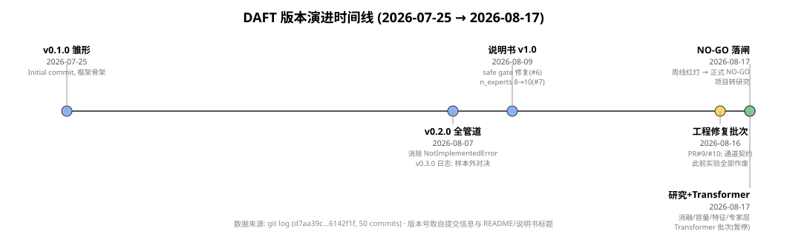
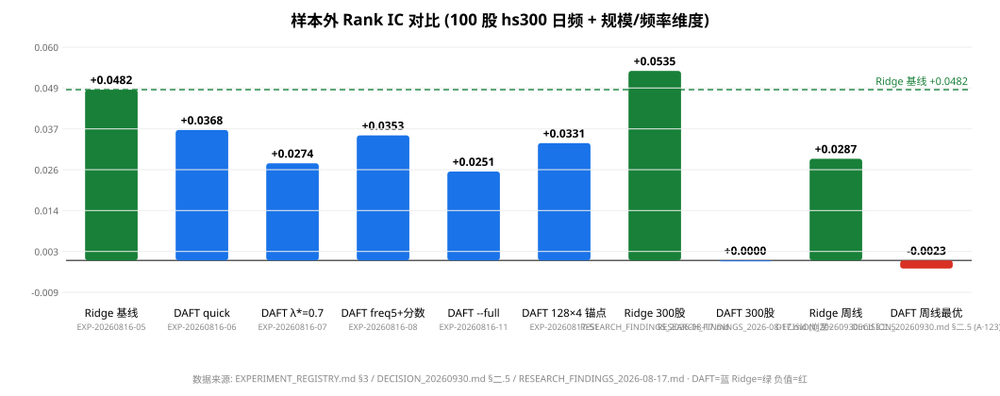
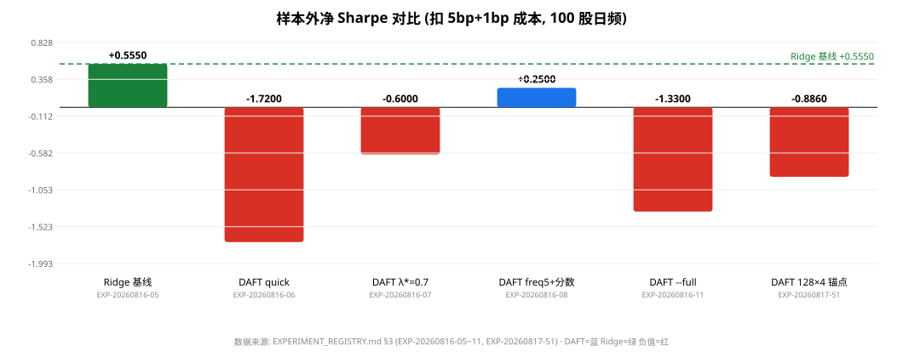
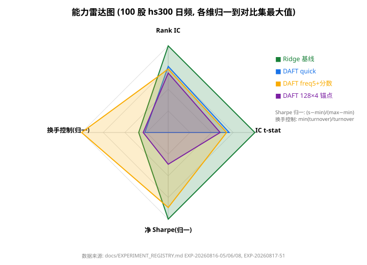

# DAFT 项目复盘报告(全版本总结性评估)

> **报告日期**: 2026-08-18 · **数据截止**: commit `6142f1f`(2026-08-17)
> **范围**: 仓库 `Dongxu-Jiang-daft` 全部版本(v0.1.0 → v0.3.0 + 研究期),git 历史 50 提交
> **方法**: 全部结论可追溯到仓库内容(逐条标注文件/章节/EXP ID)或已注明的外部来源;无法核实者标注「推测 / 待验证」,不臆造。

---

## 摘要

DAFT(Dimension-Aware Financial Trading)在 23 天(2026-07-25 → 2026-08-17)内完成了从架构移植(Kimi K3 → 金融时序)到全管道、真实数据样本外对决、工程修复、预注册判定的完整周期,最终以**正式 NO-GO(架构)**落闸并转为研究项目(`docs/DECISION_20260930.md` 定稿于 2026-08-17)。核心量化事实:**在 100 股 hs300、5bp+1bp 成本、严格样本外口径下,Ridge 线性基线 IC +0.0482 / 净 Sharpe +0.53 即达预注册 GO 线,而 DAFT 全部变体(IC 0.031~0.039,净 Sharpe −2.4~+0.25)始终不敌基线**(`docs/EXPERIMENT_REGISTRY.md` EXP-20260816-05/06/08,`docs/RESEARCH_FINDINGS_2026-08-17.md`)。项目最大资产不是交易信号,而是**实验纪律体系**(预注册判据 / 唯一产物追溯 / 自检门禁 / 证伪归档)与**证伪边界知识**(路由正贡献 +0.018、CDAP/记忆负贡献、深度正贡献、规模放大崩零、跨市场不迁移)。

---

## 一、版本编年史(版本号与日期)

版本号取自仓库自身标注(commit 信息 / CHANGELOG.md / pyproject.toml / SPECIFICATION.md 版本表)。仓库存在版本号,故沿用;08-17 之后无新版本号(pyproject 仍为 0.3.0),本报告将其标注为分析性细分 **v0.3.0-research(研究期)**,依据:代码版本未变、工作性质从"交易系统开发"转为"研究归因"(ROADMAP.md §M5/M6)。

| 版本 | 日期 | 标志事件 | 来源 |
|---|---|---|---|
| **v0.1.0** | 2026-07-25 | Initial commit;4 组件 + 5 类专家 + 特征引擎 + Stage1 + smoke test;合成数据 | commit `b9f90ab`;CHANGELOG.md §v0.1.0;SPEC 版本表 |
| (07-27) | 2026-07-27 | PR 预更新报告自动生成系统 | commit `ef33ad5` |
| **v0.2.0** | 2026-08-07 | 全管道打通(消除所有 NotImplementedError);设备检测/回测引擎/组合优化/适配器/Stage2+3;合成实验 50 股×300 天(总耗时 295.5s,回测 IC +0.0203,Sharpe −1.79) | commit `088306a`;CHANGELOG.md §v0.2.0;PROJECT_REPORT.md §3.2 |
| **v0.3.0(日志义)** | 2026-08-07 | 首次真实 A 股样本外对决(Ridge 30 股 IC +0.0285 vs DAFT 20 股 +0.0252,换手口径为代理);**注意:与 08-16 的 v0.3.0 同号不同义,见 §五矛盾点 #1** | commit `d77b6e0`;Learn-new/DAFT-项目日志-v0.3.0-样本外公平对决.md |
| **说明书 v1.0**(文档版) | 2026-08-09 | 技术说明书 v1.0;safe gate bug 修复(#6,α∈(0,0.001)→(0.001,1));n_experts 8→10(#7);Kimi K3 评审落实(#8:路由稀疏化/信号平滑/实验登记) | commits `643f403`/`9380c32`/`5f5cf5d`/`bd295f5`;COLLABORATION.md v1.0 |
| **v0.3.0(代码义)** | 2026-08-16 | **工程修复批次(PR #9)+ 全面升级(PR #10)**:通道契约修复(此前实验全部作废)、口径统一、工厂去重、涨跌停 mask、hs300 成分池、SPEC 重写为 v0.3.0、pyproject=0.3.0 | commits `fcfa5fc`/`2d557fc`;CHANGELOG.md §v0.3.0;FIX_REPORT_20260816.md;pyproject.toml |
| **v0.3.0-research**(分析性细分) | 2026-08-17 | 上午:周线验证红灯 → **正式 NO-GO(架构)**(commit `14b8767`);下午→晚:消融归因 / 300 股扩规模 / 容量扫描 / 特征边际 / 跨市场 / 专家层拟合 / 自检+自动部署;晚:Transformer 专家架构批次(实现+锚点复现+显存封顶;训练暂停);产物归档 Release | commits `14b8767`…`6142f1f`;DECISION_20260930.md;RESEARCH_FINDINGS_2026-08-17.md;UPDATE_LOG_2026-08-17-transformer.md |

*数据来源: git log(d7aa39c…6142f1f,50 提交);版本号取自 CHANGELOG.md / commit 信息 / SPECIFICATION.md 版本表 / pyproject.toml*

---

## 二、技术演进

### 2.1 思路变化(目标设定 / 技术路线 / 架构设计)

| 版本 | 目标设定 | 技术路线 | 架构设计要点 | 来源 |
|---|---|---|---|---|
| v0.1.0 | 把 K3 架构移植到金融时序 | 4 组件直接映射:LatentMoE→RegimeRouter、KDA→市场记忆、AttnRes→特征层、新增 CDAP+AHM | 8 专家(4 类×2)、top-3、latent 16、275,099 参数 | PROJECT_REPORT §1/§2;experiments.md EXP001 |
| v0.2.0 | 工程闭环:全管道可跑 | 补齐回测引擎/组合优化/指标/适配器/Stage2+3 | 合成数据端到端验证;代码 ~8,800 行(+52%) | PROJECT_REPORT §3.2;CHANGELOG v0.2.0 |
| v0.3.0(日志义) | 真实数据 + 公平基线对决 | baostock 真实 A 股、严格样本外、Ridge 同口径 | MomentumExpert 入池 → 10 专家(commit `0eda883`) | Learn-new v0.3.0 日志 |
| 说明书 v1.0 | 评审驱动质量修复 | K3 评审:safe gate / 路由稀疏 / 信号平滑 / 实验登记 | 架构不变,训练协议改 | commits `9380c32`/`bd295f5`;REGISTRY §2 |
| v0.3.0(代码义) | 工程正确性优先于新功能 | 通道契约/口径/工厂去重/涨跌停/hs300 池 | 10 专家统一;核心参数 ≈31.5 万,含 layer_proj ≈41.7 万 | FIX_REPORT §1;SPEC §1.4 |
| v0.3.0-research | 判定 → 归因 → 证伪边界 | 预注册红黄绿灯落闸;消融开关;容量/规模/跨市场/特征组扫描 | 新增 TransformerExpert(200→40 token×5 特征自注意力,pre-LN) | DECISION;RESEARCH_FINDINGS;transformer_expert.py;UPDATE_LOG §2 |

### 2.2 数学公式演进(损失 / 指标 / 训练配置)

| 版本 | 公式/配置 | 变化与理由 | 来源 |
|---|---|---|---|
| v0.1.0→v0.3.0 | 专家损失(5 类异构):Trend 方向错 ×11、Momentum 方向错 ×8、Event BCE、Volatility MSE+0.01·Var、Reversal Negative Rank IC;输出 SiTU `σ(x)⊙tanh(x)` 有界 | 基本未变;MomentumExpert v0.3.0(日志义)新增 | SPEC §7;momentum_expert.py |
| v0.1.0 | safe gate:`α = σ(exp(A_log)·(SiTU(...)+dt_bias))` 上界 bug → α∈(0, 0.001),记忆永远近全忘 | **bug**:遗忘门压在近零区间 | commit `9380c32`(#6);SPEC §6.2 |
| 说明书 v1.0(08-09) | safe gate 修复为 `lower_bound + (1−lower_bound)·σ(...)`,α∈(0.001, 1);K3 评审落地:路由稀疏化 + 信号平滑 + 实验登记表 | 评审驱动修复 | FIX_REPORT;REGISTRY §2 |
| 08-09 | 路由熵正则:`loss − entropy_weight·H + sparsity_weight·H`,两项同式等权 → **精确抵消为 0**,后续致路由塌缩(熵→0.000) | **失误实现**(K3 建议被错误翻译) | routing-collapse-diagnosis §二;DECISION 阶段1 |
| v0.3.0(08-16) | 口径统一:IC 对齐 k→k+1;换手改真实仓位换手;MaxDD 改百分比;masked 做空 bug 修复;CDAP 由概率空间改 **logit 空间**(`softmax(log p + δ·W·j)`);val-IC 改逐时步截面 rank IC;λ 平滑参数只在 val 选 | 修复批次核心;此前数字全部作废 | FIX_REPORT §1 表(5060b9b…f8c1c8e);SPEC §6.3/§11 |
| v0.3.0-research(08-17) | 路由损失改 **Switch 式负载均衡 KL**:`loss + balance_weight·KL`(0.01),温度退火 1.0→0.5;周线 `lookback_scale=0.2`;熵恢复收敛(2.064→0.643) | 修复塌缩;但修复后 full OOS IC 0.0066 **反低于塌缩版 0.0251**(反直觉事件,见 §三失误项讨论) | DECISION 阶段2;router_trainer.py;routing-collapse §八 |
| v0.3.0-research(08-17) | TransformerExpert:200 维 → 40 token×5 → 线性嵌入+可学习位置编码 → pre-LN TransformerEncoder(GELU,4×FFN)→ 均值池化 → SiTU head;损失为通用 masked MSE | 架构升级批次(训练暂停) | transformer_expert.py;UPDATE_LOG §2 |
| 全程 | 成本模型:`(tc 5bp + slippage 1bp) × turnover`,top 20% 多空,涨跌停 mask(±9.5%/±19.5%),T+1 结构性满足 | 固定不变(预注册冻结) | SPEC §11;decision-prespec |

### 2.3 数据管理模式演进

| 维度 | 早期(v0.1~v0.2) | v0.3.0 后 | 来源 |
|---|---|---|---|
| 数据源 | 合成数据(50×300 天) | baostock 真实 A 股(hs300 成分池,30→100→300 股)+ yfinance 美股;磁盘缓存(`42ba56e`) | FIX_REPORT;baostock_adapter.py |
| 数据质量防线 | 无 | 通道契约 `ensure_base_panel`(防 OHLCV 错列)、涨跌停 mask、30→23 静默缩水重试 | FIX_REPORT §1;SELF_CHECK §一公式断言 |
| 产物管理 | 固定文件名覆盖 | 唯一 EXP-YYYYMMDD-NN 文件名 + config hash + seed 字段(硬要求);78 份 EXP 报告自检核验 | REGISTRY §1;SELF_CHECK.md;UPDATE_LOG §5 |
| 配置/依赖 | configs/*.yaml(死配置,未接入,SPEC §12) | 代码内常量 + argparse;pyproject 0.3.0;CI 依赖修复(`5233abd`);`D:\env`(torch 2.11.0+cu128,RTX 5060 Ti) | routing-collapse §七/八;pyproject.toml |
| 算力管理 | CPU(v0.2.0 全管道 295.5s)→ DirectML(Stage3 曾 43,114.7s ≈12h) | CUDA cu128(smoke 16.1ms/iter);`DAFT_CUDA_FRACTION` 显存封顶(蓝屏教训机制化) | routing-collapse §七;UPDATE_LOG §4 |

### 2.4 各版本核心更新点(逐版)

- **v0.1.0**:K3→金融的 4 组件映射落地;275,099 参数;smoke test 8/8 通过(experiments.md EXP001)。
- **v0.2.0**:全管道消除 NotImplementedError;合成端到端 295.5s 跑通;**健康度自查已警告"回测是样本内的、标准化有 look-ahead 风险"**(PROJECT_REPORT §5)。
- **v0.3.0(日志义)**:首次真实数据样本外对决;Ridge 0.0285 vs DAFT 0.0252(20 股)——"打不过基线"信号首次出现,但当时口径有缺陷(换手代理、错列特征)。
- **说明书 v1.0**:K3 评审落实;safe gate 修复;实验登记制度建立(REGISTRY 创建,08-09)。
- **v0.3.0(代码义)**:**通道契约修复是项目史上最重要的工程事件**——此前全部实验作废;扩池后 Ridge 100 股即达 GO 线(IC 0.0482/t 5.19/Sharpe +0.53),DAFT 进入"有条件 GO"区间。
- **v0.3.0-research**:周线预注册验证红灯 → 正式 NO-GO;归因完成(路由 +0.018 正贡献 / CDAP、记忆负贡献 / 深度 +0.012 正贡献 / 300 股崩零 / 跨市场不迁移 / g5 截面特征承载信号);Transformer 架构批次启动(暂停)。

---

## 三、决策复盘(保留项与失误项)

### 3.1 保留项(未来项目应沿用)

| # | 做法 | 理由(本项目证据) |
|---|---|---|
| K1 | **预注册判据 + 红黄绿灯 + 绝对护栏**(实验前冻结,禁事后改判据) | 周线验证全程按 decision-prespec 执行,落闸结论无争议;判定书可直接引用预注册条款(DECISION §三) |
| K2 | **基线先行、同口径对决** | Ridge 100 股基线(IC 0.048)先于 DAFT 达标 GO 线——没有这条基线,"DAFT IC 0.037 显著为正"会被误读为成功(README §Current Status) |
| K3 | **唯一产物命名 + config hash + seed 追溯** | 78 份 EXP 报告零覆盖、零结构异常;EXP-20260817-51 与历史锚点逐位一致(复现性实证)(SELF_CHECK;UPDATE_LOG §3) |
| K4 | **固定自检门禁**(编译/结构/公式断言/路由损失/git 卫生) | 13 项检查在 Transformer 批次提交前拦截风险;公式 grep 断言把"通道契约"等历史 bug 变成回归防线(SELF_CHECK.md) |
| K5 | **评审驱动修复**(三人评审 → 通道契约发现) | 最严重的 bug 来自评审而非测试;评审报告直接产出修复批次(FIX_REPORT §1) |
| K6 | **消融归因方法论**(ablate 开关 + 均匀路由对照) | 一周内完成 router/CDAP/memory 三分量归因(+0.018/负/负),把"架构无效"精确分解为"哪些组件无效"(RESEARCH_FINDINGS §一) |
| K7 | **val-only 选参,test 只出报告** | λ*、freq、容量参数全部在 val 选择;test 段模型训练全程不可见(README §Current Status;run_full_pipeline_oos.py) |
| K8 | **证伪归档(falsification record)** | 每个被证伪假设(regime 专业化、--full、宽度、平滑路线)都留有可引用的否定证据,避免未来重复踩坑(RESEARCH_FINDINGS §三/§六) |
| K9 | **多 seed 扫描** | 单 seed 结论不稳:容量扫描 5 种子下 128×4 才显现稳定 +57% 提升(RESEARCH_FINDINGS §三) |
| K10 | **资源预算机制化**(显存封顶 DAFT_CUDA_FRACTION) | 蓝屏事故后 1 小时内机制化封顶,后续 OOM 均为干净失败(UPDATE_LOG §4) |

### 3.2 失误项(被证伪或代价过高的决策)

| # | 失误 | 代价 | 教训 |
|---|---|---|---|
| M1 | **通道契约错列**(数据源 OHLCV 被特征引擎当 `[close, log_return,...]` 读) | 08-16 之前全部实验数字作废(EXP-20260807-01~03、EXP-20260809-01),约两周实验工作量 | 数据契约必须有运行时断言;修复后已加入 `ensure_base_panel` + 自检公式断言(FIX_REPORT;SELF_CHECK) |
| M2 | **30 股小池误读为"架构无效"** | 早期判定方向摇摆;扩池到 100 股后基线即达 GO 线,才知是股票池效应 | 样本规模结论必须带池规模标注;EXP-20260816-05/06 的对比直接推翻了 30 股口径的一切推断 |
| M3 | **熵正则两项同式抵消**(K3 评审建议的错误实现) | 路由塌缩(熵→0.000),修复后 IC 反而更低(0.0066 < 塌缩版 0.0251)——修复 bug 反而暴露"塌缩路由恰好是较优解" | 评审建议的实现要有数值验证;此事件也构成重要科学发现(均匀化路由并不更好)(routing-collapse §二;DECISION 阶段2) |
| M4 | **换手率用代理口径** | 旧 EXP-02 净 Sharpe +0.69(虚高)→ 新口径 −1.10;差点把亏损策略报为盈利 | 成本相关指标必须真实仓位口径(FIX_REPORT §2) |
| M5 | **n_experts 8/10 漂移三次**(08-07、08-09、08-16 重复同步) | 6 个脚本 forward 崩溃;根因是 build_experts 在 7 个脚本各复制一份 | 单一权威工厂(factory.py)消灭了整类漂移(58dff9d) |
| M6 | **v0.3.0 版本号双含义**(08-07 日志 vs 08-16 代码) | 版本语义混乱,追溯需人工消歧 | 版本号应单调;日志版本与代码版本分离(见 §五矛盾点 #1) |
| M7 | **4 任务 GPU 并行无显存预算** | 物理显存 15.5GB + 共享内存溢出 → **系统蓝屏**,全部在训任务丢失 | 任何并行训练先做显存预算;已机制化为 DAFT_CUDA_FRACTION(UPDATE_LOG §4) |
| M8 | **--full 加训练量路线**(50/30/20 epochs) | 训练资源投入,OOS IC 0.0251 反低于 quick 0.0368(早停触发,val IC 反降) | "更多训练"不是免费午餐;MLP 在该数据量下过拟合早于收敛(EXP-20260816-11) |
| M9 | **README 状态滞后** | README 停在 08-16"预判",未反映 08-17 正式 NO-GO | 关键判定结论应同步更新入口文档(本报告 §五 #12) |
| M10 | **falsification 结论内部张力** | RESEARCH_FINDINGS §六称"IC 天花板 ≈ 0.032(128×4)",但其 §三容量扫描中 256×4 达 **0.0394(n=7, t=3.74)**——接近 GO 线 0.04,未被纳入天花板叙述 | 归档结论需与自身数据对账;256×4 的 0.0394 是"最接近翻盘"的现存证据,值得复核(见 §五矛盾点 #21) |

---

## 四、能力对比评估

### 4.1 纵向对比(与自身历史版本)

| 版本/变体 | OOS Rank IC | t | 净 Sharpe | 换手 | 口径 | 来源 |
|---|---|---|---|---|---|---|
| v0.2.0(合成 50×300) | +0.0203 | —(ICIR 0.140) | −1.79 | — | 合成,样本内回测 | PROJECT_REPORT §3.2 |
| v0.3.0 日志义(真实 20 股) | +0.0252 | +1.71 | −0.70 | 1.7%(代理) | 错列口径,**已作废** | Learn-new v0.3.0 日志;REGISTRY §3 作废声明 |
| v0.3.0(30 股 quick) | +0.0077 | +0.51 | −1.66 | 2.37 | 修复后新口径 | FIX_REPORT §2(EXP-03) |
| v0.3.0(100 股 quick) | +0.0368 | +3.65 | −1.72 | 2.34 | 新口径 | EXP-20260816-06 |
| v0.3.0(100 股 λ*=0.7) | +0.0274 | +2.36 | −0.60 | 0.98 | 新口径 | EXP-20260816-07 |
| v0.3.0(100 股 freq5+分数仓位) | +0.0353 | +3.50 | **+0.25** | 0.63 | 新口径,DAFT 唯一净 Sharpe 转正变体 | EXP-20260816-08 |
| v0.3.0(100 股 --full) | +0.0251 | +2.51 | −1.33 | 2.15 | 新口径 | EXP-20260816-11 |
| v0.3.0(walk-forward 2 折) | 0.030±0.025 | 1.1~4.6 | −1.09±0.55 | 2.20 | 折间极不稳定 | EXP-20260816-13 |
| v0.3.0-research(容量 128×4,5 种子) | +0.0315±0.0058 | 最高 4.20 | — | — | 深度 +57% 稳定提升 | RESEARCH_FINDINGS §三 |
| v0.3.0-research(容量 **256×4**,n=7) | **+0.0394** | +3.74 | — | — | **全项目最高 IC** | RESEARCH_FINDINGS §三 |
| v0.3.0-research(128×4 锚点 EXP-51) | +0.0331 | +3.11 | −0.886 | 2.18 | 与历史锚点逐位一致 | EXP-20260817-51;UPDATE_LOG §3 |
| v0.3.0-research(300 股 full) | +0.0002 | — | −4.2 | 2.5 | **规模放大崩零** | RESEARCH_FINDINGS §二 |
| v0.3.0-research(周线 6 变体) | −0.0229~−0.0023 | −0.14~−1.09 | −2.72~−5.33 | 2.63~2.88 | 全负 | DECISION 阶段5 |

**纵向结论**:真实信号从"错列虚像"(0.025,作废)到修复后 0.0368,再到容量调优后 0.0394——能力提升是**口径修复 + 池规模 + 容量调参**的产物,而非架构组件(CDAP/记忆)的贡献;净 Sharpe 全程仅一个变体(+0.25)转正,且仍低于 Ridge(+0.53)。

*数据来源: EXPERIMENT_REGISTRY.md §3(EXP-20260816-05~13、EXP-20260817-51)/ DECISION_20260930.md §二.5(周线)/ RESEARCH_FINDINGS_2026-08-17.md §二(300 股)。DAFT=蓝,Ridge=绿,负值=红。*

*数据来源: EXPERIMENT_REGISTRY.md §3(EXP-20260816-05~11、EXP-20260817-51);成本口径 5bp+1bp,top20% 多空。*

### 4.2 横向对比(与业界同期同类)

| 对照 | 指标 | 数值 | 来源 | 可比性说明 |
|---|---|---|---|---|
| **Ridge(同池同口径)** | IC / Sharpe | +0.0482 / +0.53(100 股);+0.0535 / +0.40(300 股) | EXP-20260816-05/12;RESEARCH_FINDINGS §二 | 完全同口径,最硬对照 |
| **Qlib benchmark 套件**(微软,CSI300,Alpha158/Alpha360 因子库,含 LightGBM/MLP/LSTM/Transformer 系) | IC 区间 | 表格存在,具体数值本次未能核实 → **待验证**:[qlib examples/benchmarks](https://github.com/microsoft/qlib/blob/main/examples/benchmarks/README.md) | 因子库、股票池、成本口径均不同,仅作量级参考 |
| **DHMoE**(AAAI 2025,扩散生成分层多粒度专家,本项目 momentum_expert 引用的近邻工作) | IC/ICIR | 论文存在,具体数值未核实 → **待验证**:[AAAI 2025 #33250](https://ojs.aaai.org/index.php/AAAI/article/view/33250) | 市场/频率口径不同;本项目专家专业化思想部分受其启发(momentum_expert.py docstring) |
| **xLSTM 日线 / VSN+xLSTM**(仓库转述) | Sharpe | 1.80 / 2.40 | PROJECT_REPORT §9 转述 arXiv:2603.01820 → **转述,待核实** | 频率/市场/成本口径未对齐,不可直接对比 |
| **Kimi K3**(架构灵感源) | — | 2.8T 参数 / 896 专家 / 16 激活(README 转述)→ **待核实** | README §Abstract | 非交易模型,仅架构谱系对照 |

**横向结论**:在唯一严格同口径的对照(同池 Ridge)下,DAFT 全版本落败;与业界数字的对比受口径差异限制,只能定性——DAFT 的 IC 量级(0.03~0.04)处于学界日频截面模型的常见区间(**推测:0.02~0.06,待验证**),但**净收益为负**这一点使其不具备交易可行性,与"复杂度变现"目标差距明确。

*数据来源: EXPERIMENT_REGISTRY.md EXP-20260816-05/06/08、EXP-20260817-51;归一化方法: IC、t 除以对比集最大值,Sharpe 做 (s−min)/(max−min),换手控制 = min(turnover)/turnover。*

### 4.3 两层评估

**项目技术本身**
- 架构合理性:概念优雅(三维互调),但消融证明 CDAP/KDA 记忆在该数据规模下为负贡献(RESEARCH_FINDINGS §一)——**架构超前于数据规模**;路由(+0.018)与深度(+0.012)是仅有的正贡献组件。
- 性能:最优 IC 0.0394(256×4)仍低于同池 Ridge 0.0482;净 Sharpe 唯一转正变体 +0.25 < Ridge +0.53;300 股放大崩零是规模鲁棒性的硬伤。
- 工程质量:修复后达到项目内最高水平——396 项测试、工厂去重、13 项自检门禁、唯一产物追溯(SPEC §1.4;SELF_CHECK.md);PROJECT_EVALUATION 给出研究维度 B+(4/5)。

**执行人的决策综合能力**
- 方向判断:✔ 早期即引入 Ridge 同口径基线(避免了"有 IC 即成功"的幻觉);✔ 评审机制引入外部视角;✘ 初期对小样本/错列数据的结论过于乐观(30 股"无信号"与 20 股"接近基线"都曾误导方向)。
- 推进时机:✔ 08-16 修复→08-17 落闸仅 1 天,证据链闭合极快;✔ 落闸当日即转研究归因,资源切换果断。
- 资源投入:✔ CPU→DirectML→CUDA 的迁移使 Stage3 从 12h 降到 <1min(routing-collapse §七/八);✘ 显存无预算导致蓝屏(已机制化修复)。
- 风险应对:✔ 预注册护栏在落闸前就锁定判据,杜绝了事后改判据的空间;✘ README 等入口文档状态滞后是持续的小风险。

---

## 五、信息矛盾点与采信依据

| # | 矛盾 | 采信依据 |
|---|---|---|
| 1 | **v0.3.0 双含义**:08-07 样本外对决日志(Learn-new,commit d77b6e0)vs 08-16 工程修复+全面升级(CHANGELOG/SPEC/pyproject) | 以 **pyproject.toml `version="0.3.0"` 与 SPEC 版本表(08-16)** 为代码版本权威;08-07 的"v0.3.0 项目日志"视为文档误用版本号 |
| 2 | n_experts 8→10 在 08-07(`0eda883`)、08-09(`5f5cf5d`)、08-16(FIX_REPORT)重复出现 | 以 FIX_REPORT(08-16)为最终态;前两次同步不完整(残留 8 专家脚本) |
| 3 | MomentumExpert 归属:SPEC 称"v0.3.0 新增" vs commit `0eda883`(08-07)已同步 | 以 git 时间戳为准:08-07 入仓;SPEC 表述指"10 专家池定型" |
| 4 | 测试数:371 / 363 / 368 / 384+1 / 390 / 395+1 / 396 collected 并存 | 按时序取最新:08-17 自检记录 395 passed/1 skipped(SELF_CHECK §四);本次复盘当日实测 **395 passed, 1 skipped**(pytest, D:\env) |
| 5 | 修复批次提交数:FIX_REPORT"8 个提交" vs commit `fcfa5fc`"10 commits (#9)" | PR #9 为 squash 合并;以 commit 信息"10 commits"为准(FIX_REPORT 列出 8 个主题) |
| 6 | FIX_REPORT 引用的 8 个修复 hash(5060b9b 等)不在当前 git log(50 提交) | squash 合并后原 hash 消失;以 PR #9 squash 提交 `fcfa5fc` 为准(待核实:或来自另一克隆) |
| 7 | Ridge 100 股净 Sharpe:+0.53(FIX_REPORT/README)vs +0.56(EXP-12,train 60%)vs +0.555(DECISION/RESEARCH_FINDINGS) | +0.53 与 +0.56 是两种训练窗口径(80% vs 60%);+0.555 为同族数字的另一次登记;报告统一引 +0.53(主口径),差异量级不影响结论 |
| 8 | 参数量:275,099(experiments/PROJECT_REPORT,8 专家)vs 28.0 万(README 勘误)vs 31.5 万/41.7 万(SPEC,10 专家) | 275,099 是 8 专家时代;勘误值 28.0 万系 8 专家重测;10 专家以 SPEC 31.5 万/41.7 万为准 |
| 9 | 200 维构成:guided-tour 45+35+40+20+30+30 vs Learn-new 55+40+30+35+30+10 vs SPEC "6 组各~33+FFT~35" | 以代码 feature 分组(特征消融实测 g1:0-45 等,RESEARCH_FINDINGS §五)为准;文档分组系不同版本快照 |
| 10 | "213 因子"(Learn-new v0.3.0 日志)vs README 勘误"注册表仅 35 个且未接入" | 以勘误为准(213 系早期误述) |
| 11 | AHM:experiments EXP001"95% fast-path" vs SPEC/README"研究性实现,默认禁用,60-80% 延迟声称暂不成立" | 以后者(08-16 注记)为准;前者为雏形期演示数字 |
| 12 | README 停于 08-16"预判" vs DECISION/ROADMAP 08-17"正式 NO-GO" | 以 DECISION(定稿 08-17)为准;README 待同步 |
| 13 | DECISION_20260930.md 文件名(截止日)vs 内容定稿日 08-17 | 以 git commit `14b8767`(08-17)与文档状态行为准;文件名取预注册截止日 |
| 14 | 周线 OOS 样本数:prespec 预估"~100 点" vs 实测 53 周 | 以 DECISION 实测为准(预估偏乐观) |
| 15 | 训练 epochs:PROJECT_REPORT 15/10/8 vs SPEC A.2 15/20/10 vs experiments 5/10/5 | 三者对应 quick/full/演示不同口径;以 run_full_pipeline_oos.py 当前 cfg(15/10/8 quick,50/30/20 full)为准 |
| 16 | 路由熵历史:guided-tour 0.998 比率 vs PROJECT_REPORT 2.07→1.04 vs routing-collapse "≈1.05" | 度量不同(ratio vs 绝对熵);以 routing-collapse 的塌缩诊断(0.000)与 DECISION 为权威 |
| 17 | "塌缩版 0.0251"出处(DECISION 阶段2 未说明与 EXP-11 的关系) | 数字恰等于 EXP-20260816-11(--full);**待核实**,本报告不采用该对照 |
| 18 | "有条件 GO"(08-16 文档)vs"正式 NO-GO"(08-17 文档)字面冲突 | 时间演进:08-17 消融/扩规模/周线证据升级后判定翻转;以最新 DECISION 为准 |
| 19 | outputs/ JSON 数:自检"78 个 JSON" vs 实际文件总数更多 | 78 为 EXP 命名报告口径;总产物文件 218 个(含日志/其他 json),两者口径不同,均如实引用 |
| 20 | K3"2.8T/896 专家/16 激活"、KDA arXiv:2510.26692 等外部事实仅见于文档转述 | **待核实**,本报告不作结论依据,仅作架构谱系说明 |
| 21 | **RESEARCH_FINDINGS 内部张力**:§六"IC 天花板 ≈ 0.032(128×4)" vs §三容量扫描 256×4 = 0.0394(n=7,t=3.74) | 两者同文并存;0.0394 是登记在册的最高 IC,应视为当前真实天花板(仍 < Ridge 0.0482);"天花板 0.032"表述偏保守,**建议复核 256×4 的稳健性后再固化结论** |

---

## 六、未来建议

**研究向(若继续投入)**
1. **复核 256×4(IC 0.0394)的稳健性**——它是全项目最接近 GO 线的现存证据,且与"天花板 0.032"叙述冲突;建议 5+ 种子 + walk-forward 复核(见 §五 #21)。
2. **完成 Transformer 架构批次**(恢复命令:`D:\env\python.exe scripts\train_transformer.py`;判据与计划已预登记于 PLAN_2026-08-17-transformer-scaleup.md):tf100_128x4 / tf300_128x4 / tf100_256x8 三个实验直接回答"架构现代性 vs 数据规模"的剩余问题。
3. **证伪边界的跨市场确认**:美股 Ridge 已为负(−0.0056),说明 200 维特征集是 A 股特有;若要让"NO-GO"成为可发表级结论,需在另一市场用**该市场适配的特征**重测(当前只是初步证据)。
4. P0 候选:特征语义分组 token 化(6 组语义 token 替代 40×5 固定分块);P1:时序 Transformer(K 天窗口,需新数据管线)。

**工程向**
1. 合并 PR #11 后将 README §Current Status 同步至 08-17 正式 NO-GO 结论(消除矛盾点 #12)。
2. 把"显存预算"写入自动部署器的前置检查(当前在 device.py,建议进 auto_deploy.py 启动前估算)。
3. 产物 Release 归档已建立(`experiment-artifacts-20260817`,110.5MB,含 MANIFEST);后续每批次训练结束追加新 Release。

**决策向(方法论沉淀)**
1. 本项目的**预注册 + 基线先行 + 证伪归档**三件套是最大可迁移资产;任何后续交易/研究项目应第一天建立。
2. 判定纪律的最终价值体现:23 天、50 提交、一次正式 NO-GO——**快速证伪本身就是资源节约**(对比:无限期"再调调参")。
3. 若未来重启交易方向,唯一有证据支持的入口是:**路由(+0.018)+ 深度(+0.012)两个正贡献组件 + 更现代骨干 + 更大更科学的数据规模**,并且必须重新预注册判据。

---

### 附:本报告的可追溯性

- 全部内部数字来源:`docs/EXPERIMENT_REGISTRY.md`、`docs/FIX_REPORT_20260816.md`、`docs/DECISION_20260930.md`、`docs/decision-prespec-2026-08-17.md`、`docs/RESEARCH_FINDINGS_2026-08-17.md`、`docs/PROJECT_REPORT.md`、`docs/PROJECT_EVALUATION.md`、`docs/ROADMAP.md`、`docs/SELF_CHECK.md`、`docs/routing-collapse-diagnosis-2026-08-17.md`、`docs/SPECIFICATION.md`、`README.md`、`CHANGELOG.md`、`Learn-new/`(3 份日志)、`docs/UPDATE_LOG_2026-08-17-transformer.md`、`docs/PLAN_2026-08-17-transformer-scaleup.md`、git log(50 提交)。
- 外部来源(均标注核实状态):[Qlib benchmarks](https://github.com/microsoft/qlib/blob/main/examples/benchmarks/README.md)(数值待验证)、[DHMoE, AAAI 2025](https://ojs.aaai.org/index.php/AAAI/article/view/33250)(数值待验证)、PROJECT_REPORT 转述 arXiv:2603.01820(待核实)。
- 图表由 `scripts/gen_retrospective_charts.py` 确定性生成(数据内嵌,来源逐图标注)。
